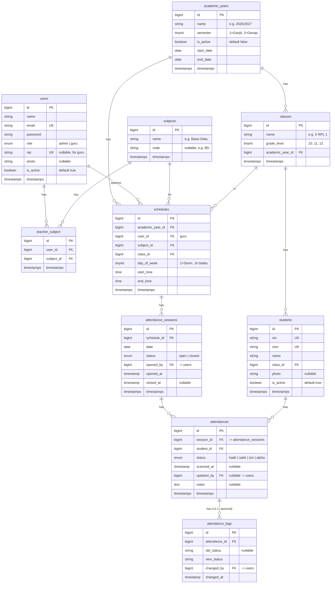

# 🔵 Ocular — Sistem Absensi Digital RPL

## Product Requirements Document (PRD)

---

## 1. Executive Summary

**Ocular** adalah platform web aplikasi absensi digital khusus jurusan Rekayasa Perangkat Lunak (RPL). Sistem ini menggunakan QR Code pada ID card siswa yang di-scan oleh guru melalui kamera browser (HP/laptop) untuk mencatat kehadiran per pertemuan mata pelajaran.

| Item | Detail |
|------|--------|
| **Target User** | 8 Guru RPL, 1+ Admin, ~180-240 Siswa |
| **Kelas** | 3 angkatan × 2 paralel = 6 kelas |
| **Tech Stack** | Laravel 13, Tailwind CSS v4, Alpine.js, Vite |
| **Database** | MySQL 8 (via Laragon) |
| **Deadline** | Pertengahan Agustus 2026 — **~9 hari efektif per 6 Agustus 2026** (lihat 1.1 MVP Scope) |
| **Status** | Production-ready untuk sekolah (MVP — lihat 1.1 untuk pembagian prioritas) |

**Out of Scope:** Sistem ini hanya mencakup mata pelajaran yang diampu oleh 8 Guru RPL, **tidak** mencakup mata pelajaran umum/lintas jurusan lain di sekolah.

### 1.1 MVP Scope & Prioritas

Per 6 Agustus 2026, jika "pertengahan Agustus" berarti sekitar tanggal 15, sisa waktu efektif hanya **~9 hari**, bukan 2 minggu penuh. Dengan scope selengkap ini (multi-role, scanner + banyak edge case, import CSV, dashboard, export, kenaikan kelas), prioritas berikut wajib dipegang agar sistem tetap bisa live tepat waktu:

**Must-have (harus jalan pas sekolah mulai pakai):**
- Autentikasi (login guru/admin, role-based routing)
- Data master: siswa, guru, kelas, mapel, jadwal — CRUD manual minimal wajib jalan (import CSV boleh menyusul jika waktu tidak cukup)
- Generate QR Code siswa
- Flow absensi inti: buka sesi → scan → manual override (H/S/I/A) → tutup sesi
- Edit absensi oleh guru **dan** admin, dengan audit minimal (`updated_by`)
- Export laporan absensi ke Excel
- Dashboard ringkas (angka total, persentase kehadiran) tanpa chart detail

**Nice-to-have (boleh menyusul / masuk backlog v1.1):**
- Kenaikan kelas & kelulusan (bulk promotion) — baru kepake pas ganti tahun ajaran, kemungkinan besar masih bisa dikerjakan manual dulu sebelum sistem ini live
- Dashboard chart detail (tren mingguan/bulanan, top 5 Alpha)
- Export PDF (Excel dulu cukup untuk go-live)
- Import jadwal & siswa via CSV/Excel (CRUD manual sebagai fallback wajib ada duluan)
- Tabel `attendance_logs` (histori detail status lama → baru) — kolom `updated_by` yang sudah ada di `attendances` jadi audit minimal untuk MVP

---

## 2. Roles & Permissions

### 2.1 Siswa (Passive)
- **Tidak login** ke sistem
- Menyediakan ID card ber-QR Code (isi: NISN) untuk di-scan

### 2.2 Guru
- Login dengan email + password
- Melihat jadwal mengajar hari ini
- Membuka sesi absensi → scan QR Code siswa
- Mengedit status kehadiran (Hadir/Sakit/Izin/Alpha)
- Melihat rekap absensi kelas yang diampu
- Export laporan absensi (Excel/PDF)

### 2.3 Admin
- Login dengan email + password
- Mengelola **semua data master**: siswa, guru, kelas, mapel, jadwal, tahun ajaran
- Import jadwal via CSV/Excel
- Generate QR Code dari NISN siswa
- Melihat & export laporan absensi seluruh kelas/guru
- **Mengedit status kehadiran siswa** (override lintas guru/kelas, untuk koreksi atau menangani dispute — lihat Section 6 Admin Routes)
- **Akses darurat:** membuka/assign sesi absensi atas nama guru manapun jika guru pemilik jadwal berhalangan (izin/sakit) — `opened_by` tetap tercatat sesuai user yang membuka; tidak perlu konsep formal "guru pengganti" di database. Jika waktu development tidak cukup untuk fitur ini, minimal didokumentasikan sebagai *known limitation*.
- Dashboard statistik kehadiran
- Reset password guru

---

## 3. Core Features

### 3.1 Autentikasi
- Login (email + password, bcrypt hashed)
- Logout
- Role-based routing (admin → admin dashboard, guru → guru dashboard)
- Admin reset password guru (no self-service forgot password)
- **Fallback reset password admin:** jika satu-satunya admin lupa password, gunakan command line di server (`php artisan admin:reset-password` atau `tinker`) — hanya bisa dijalankan oleh yang punya akses server, didokumentasikan sebagai prosedur darurat

### 3.2 Data Master (Admin Only)

#### Tahun Ajaran & Semester
- CRUD tahun ajaran (contoh: "2026/2027")
- Set semester aktif (Ganjil/Genap)
- Aktivasi/non-aktifasi — data lama tetap tersimpan untuk histori
- Hanya **1 tahun ajaran + semester** yang aktif pada satu waktu

#### Kelas
- CRUD kelas (contoh: X RPL 1, X RPL 2, XI RPL 1, XI RPL 2, XII RPL 1, XII RPL 2)
- **Terikat ketat ke Tahun Ajaran:** Record kelas di-generate baru setiap pergantian tahun ajaran untuk menjaga keutuhan histori absensi.
- Tingkat kelas: 10, 11, 12

#### Kenaikan Kelas & Kelulusan (Admin)
- **Bulk Promotion:** Memindahkan seluruh siswa dari Kelas Asal ke Kelas Tujuan untuk Tahun Ajaran baru.
- **Kelulusan (Alumni):** Mengubah status `is_active = false` untuk kelas 12 yang sudah lulus, tanpa menghapus histori absensi mereka.

#### Mata Pelajaran
- CRUD mata pelajaran RPL
- Field: nama, kode (opsional)

#### Guru
- CRUD data guru
- Field: NIP, nama, email, password, mapel yang diampu (many-to-many)
- Foto opsional

#### Siswa
- CRUD data siswa
- Field: NIS, NISN, nama, kelas, foto (opsional)
- NISN = konten QR Code di ID card
- Bulk import siswa via CSV/Excel
- Generate & download QR Code per siswa atau batch per kelas

#### Jadwal
- Import jadwal via CSV/Excel
- Manual CRUD sebagai fallback
- Field: guru, mapel, kelas, hari, jam mulai, jam selesai
- Terikat ke tahun ajaran aktif
- **Validasi bentrok jadwal di level aplikasi** (unique constraint DB di Section 4 hanya safety net, tidak cukup sendirian — tidak menangkap overlap jam yang tidak persis sama, dan tidak mengecek bentrok dari sisi guru). Validasi berikut wajib dijalankan sebelum simpan, baik untuk CRUD manual maupun proses import CSV — cek overlap waktu di dua sisi: per kelas **dan** per guru:

```php
$conflict = Schedule::where('academic_year_id', $academicYearId)
    ->where('day_of_week', $dayOfWeek)
    ->where(fn($q) => $q->where('class_id', $classId)->orWhere('user_id', $guruId))
    ->where('start_time', '<', $endTime)
    ->where('end_time', '>', $startTime)
    ->exists();
```

- **Import error handling:** baris CSV yang invalid (mis. NISN duplikat, kolom kosong, jadwal bentrok) tidak menggagalkan seluruh proses. Sistem menampilkan laporan hasil: jumlah baris berhasil vs gagal, beserta alasan gagal per baris (partial success, bukan all-or-nothing). Kebijakan yang sama berlaku untuk import data siswa.

### 3.3 Sistem Absensi (Guru)

#### Flow Absensi
```
Guru Login → Dashboard (Jadwal Hari Ini)
    → Pilih/Klik jadwal → "Mulai Sesi Absensi"
        → Sistem buat record attendance untuk SEMUA siswa di kelas (default: ALPHA)
        → Guru buka scanner (kamera browser)
        → Scan QR Code siswa satu per satu (continuous/bulk scan)
            → Sistem decode NISN → lookup siswa
            → Jika NISN tidak ditemukan → tampilkan error
            → Jika siswa ditemukan tapi BUKAN bagian dari kelas pada sesi ini (nyasar ke sesi salah) → tampilkan error spesifik ("siswa tidak terdaftar di sesi ini"); JANGAN buat row attendance baru di luar roster yang sudah di-seed
            → Jika siswa valid tapi sudah di-scan sebelumnya → tampilkan notif "sudah absen"
            → Jika valid → update status ke HADIR, tampilkan feedback real-time (nama siswa, foto, status)
        → Guru bisa manual set status (Sakit/Izin) via list siswa
        → Guru tutup sesi atau otomatis tutup saat jam selesai
```

#### SOP Verifikasi Wajah (Mitigasi Risiko QR Duplication)

Format QR di ID card berisi plain-text NISN dan kartu sudah dicetak (format tidak bisa diubah lagi). Ini membuka celah "titip absen" digital: QR discreenshot dari kartu, dikirim ke teman via WA, temannya tinggal scan dari layar HP tanpa perlu memegang kartu fisik. Foto siswa yang muncul saat scan **bukan sekadar feedback pasif** — **guru wajib mencocokkan foto yang tampil dengan siswa yang hadir secara fisik di depannya sebelum lanjut ke scan berikutnya.** Karena format QR sudah fix dan tidak bisa diubah, mitigasi ini didokumentasikan sebagai *accepted risk* di Risk table (Section 10) — agar pihak sekolah aware bahwa ini bukan proteksi 100%, bukan dikira sudah aman otomatis.

#### Batas Waktu Edit & Audit Trail

- Guru dapat mengedit status kehadiran hingga **H+3** dari tanggal sesi berlangsung; setelah itu perubahan hanya bisa dilakukan Admin (override, lihat Section 2.3).
- Setiap perubahan tercatat minimal di kolom `updated_by` pada `attendances` (audit minimal, wajib ada di MVP).
- Histori detail (status lama → baru, siapa yang mengubah, kapan) idealnya masuk tabel `attendance_logs` — jika waktu MVP tidak cukup, masuk backlog v1.1 (lihat Section 1.1), jangan hilang dari radar.

#### Status Kehadiran
| Status | Kode | Deskripsi |
|--------|------|-----------|
| **Hadir** | `H` | Siswa di-scan QR atau diset manual |
| **Sakit** | `S` | Diset manual oleh guru/admin |
| **Izin** | `I` | Diset manual oleh guru/admin |
| **Alpha** | `A` | Default — tidak hadir tanpa keterangan |

> *Catatan: Status "Terlambat" sengaja tidak dibedakan dari "Hadir" (keputusan disengaja sesuai kesepakatan awal). Perlu konfirmasi ulang ke pihak sekolah bila requirement ini berubah di kemudian hari.*

#### QR Scanner Specs
- Library: `html5-qrcode` (browser-based)
- Continuous scanning mode dengan Client-side Cooldown (debounce 3 detik per NISN)
- Audio feedback (Beep/Buzzer) yang di-unlock saat tombol "Buka Kamera" diklik
- Automatic State Sync: Mengirim data ke backend via Livewire Event
- Fallback Manual: Input teks NISN manual jika kamera HP guru bermasalah/buram
- **Network Failover & Connection Indicator:** Indikator koneksi visual (Online/Offline dot). Jika koneksi terputus/Livewire request timeout saat scan, munculkan pop-up error & sound buzzer agar guru tahu data belum masuk.

### 3.4 Dashboard & Statistik

#### Guru Dashboard
- Jadwal mengajar hari ini
- Quick-action: mulai absen
- Ringkasan kehadiran per kelas yang diampu (hari ini & minggu ini)

#### Admin Dashboard
- Total siswa, guru, kelas aktif
- Persentase kehadiran keseluruhan (hari ini, minggu ini, bulan ini)
- Chart: tren kehadiran mingguan/bulanan (Chart.js)
- Top 5 siswa paling sering Alpha
- Kehadiran per kelas (bar chart)

### 3.5 Laporan & Export
- **Filter**: tahun ajaran, semester, kelas, mapel, guru, rentang tanggal
- **Format export**: Excel (.xlsx) dan PDF
- **Jenis laporan**:
  - Rekap absensi per kelas per bulan
  - Rekap absensi per siswa
  - Rekap absensi per mata pelajaran
  - Jurnal harian guru (daftar hadir per sesi)
- **Data privasi:** foto & NISN siswa adalah data pribadi anak di bawah umur (relevan dengan UU PDP). Akses lihat/export foto & data siswa dibatasi ke role Admin dan Guru yang mengampu kelas terkait — tidak boleh diakses pihak lain.
- **Format PDF laporan** (kop surat sekolah resmi, tanda tangan, dsb.) vs data mentah — perlu dikonfirmasi ke pihak sekolah sebelum implementasi (fitur PDF sendiri masuk Nice-to-have, lihat Section 1.1).

### 3.6 Generate QR Code
- Admin bisa generate QR Code dari NISN siswa
- Download per siswa (PNG) atau batch per kelas (ZIP berisi PNG)
- QR Code format: plain text NISN

---

## 4. Database Schema



Database Constraints Note:

attendances: Wajib buat `$table->unique(['session_id', 'student_id']);` untuk mencegah race condition scan ganda.

schedules: `$table->unique(['academic_year_id', 'class_id', 'day_of_week', 'start_time']);` dipertahankan sebagai safety net, **tapi tidak cukup sendirian** — hanya menangkap kasus yang persis sama. Wajib ditambah validasi overlap di level aplikasi (lihat contoh kode di Section 3.2, Jadwal) yang mengecek: (a) overlap jam yang tidak persis sama, dan (b) bentrok dari sisi guru (`user_id`), bukan cuma sisi kelas.

attendance_logs: opsional untuk MVP (v1.1) — jika waktu tidak cukup, kolom `updated_by` pada `attendances` tetap wajib ada sebagai audit minimal (lihat Section 1.1 & 3.3).

---

## 5. Tech Stack

| Layer | Technology | Justification |
|-------|-----------|---------------|
| **Backend** | Laravel 13 (PHP 8.3) | Core framework & business logic |
| **Fullstack Bridge** | Livewire 3 | Reactive UI tanpa perlu buat REST API manual |
| **Frontend UI** | Alpine.js + Tailwind CSS v4 | DOM manipulation, audio trigger, & QR scanner binding |
| **Database** | MySQL 8 (via Laragon) | Data relasional terstruktur |
| **QR Scanner** | html5-qrcode | Browser-native, supports HP & laptop |
| **Charts** | Chart.js v4 | Lightweight, responsive charts |
| **Import/Export** | Maatwebsite/Laravel-Excel 3.x | Industry standard for Laravel |
| **PDF Export** | barryvdh/laravel-dompdf | Simple HTML-to-PDF |
| **QR Generate** | simplesoftwareio/simple-qrcode | Laravel-integrated QR generation |
| **Build Tool** | Vite 8 | Already configured |
| **Auth** | Laravel built-in (bcrypt) | No extra package needed |

---

## 6. Page Map & Routes

### Admin Routes (`/admin/*`)
| Route | Page | Description |
|-------|------|-------------|
| `/admin/dashboard` | Dashboard | Statistik keseluruhan |
| `/admin/academic-years` | Tahun Ajaran | CRUD tahun ajaran + semester |
| `/admin/classes` | Kelas | CRUD kelas |
| `/admin/subjects` | Mata Pelajaran | CRUD mapel |
| `/admin/teachers` | Guru | CRUD guru + assign mapel |
| `/admin/students` | Siswa | CRUD siswa + import + generate QR |
| `/admin/students/promotion` | Kenaikan Kelas | Bulk promote siswa antar kelas/tahun ajaran & status lulus |
| `/admin/schedules` | Jadwal | CRUD + import CSV/Excel |
| `/admin/attendances` | Laporan Absensi | Rekap + filter + **edit/override** + export |
| `/admin/settings` | Pengaturan | Reset password guru |

### Guru Routes (`/guru/*`)
| Route | Page | Description |
|-------|------|-------------|
| `/guru/dashboard` | Dashboard | Jadwal hari ini + ringkasan |
| `/guru/scan/{session}` | Scanner | QR scanner + daftar hadir live |
| `/guru/attendances` | Riwayat Absensi | Rekap kelas yang diampu |
| `/guru/attendances/export` | Export | Export laporan |
| `/guru/profile` | Profil | Edit profil sendiri |

### Auth Routes
| Route | Page |
|-------|------|
| `/login` | Login |
| `/logout` | Logout (POST) |

---

## 7. UI/UX Principles

- **Mobile-first**: Guru scan pakai HP → UI harus responsif
- **Scan feedback**: Sound beep + visual flash hijau (hadir) / merah (error)
- **Minimal clicks**: Dari login → scan maksimal 3 klik
- **Real-time**: Daftar hadir update tanpa refresh (Alpine.js reactivity)

---

## 8. Non-Functional Requirements

| Requirement | Target |
|------------|--------|
| **Response time** | < 500ms untuk scan feedback |
| **Concurrent users** | 8 guru + 1 admin simultaneously |
| **Browser support** | Chrome, Safari, Firefox (latest) |
| **Camera** | Front & rear camera support |
| **Security** | HTTPS required (camera API), bcrypt password, CSRF protection |
| **Data retention** | Histori absensi preserved per tahun ajaran |
| **Backup** | Daily MySQL backup recommended |
| **Data privasi** | Akses foto & NISN siswa (data pribadi anak di bawah umur) dibatasi ke Admin & Guru pengampu kelas terkait — relevan UU PDP |
| **Hosting produksi** | Domain + hosting + SSL (Let's Encrypt) + cron job server untuk auto-close sesi — direncanakan sebelum go-live, bukan hanya HTTPS lokal untuk dev (lihat Section 10) |

---

## 9. Dependencies

```bash
# PHP packages
composer require maatwebsite/excel
composer require barryvdh/laravel-dompdf
composer require simplesoftwareio/simple-qrcode

# NPM packages
npm install html5-qrcode chart.js
```

---

## 10. Risk & Mitigation

| Risk | Impact | Mitigation |
|------|--------|------------|
| Deadline mepet — per 6 Agustus sisa ~9 hari efektif (bukan 2 minggu penuh) | High | Ikuti prioritas Must-have vs Nice-to-have di Section 1.1, pangkas fitur non-esensial dulu |
| QR berisi plain NISN bisa diduplikasi digital (screenshot → dibagikan → "titip absen") | Medium-High | **Accepted risk** — format QR di kartu sudah fix, tidak bisa diubah. Mitigasi: SOP wajib guru mencocokkan foto siswa yang tampil dengan siswa fisik di depannya sebelum lanjut scan (lihat Section 3.3) |
| Kamera browser tidak support | Medium | Fallback: manual input NISN |
| Akses kamera HP diblokir browser (Insecure HTTP) | High | Gunakan HTTPS Local (Ngrok / Cloudflare Tunnel / Laragon SSL) untuk dev |
| Audio Beep diblokir Autoplay Policy HP | Medium | Pre-load/Unlock AudioContext saat tombol "Buka Kamera" diklik |
| Scanner spamming request ke server | Medium | Pasang throttle / debounce 3 detik per NISN di Alpine.js |
| Concurrent scan oleh banyak guru | Medium | Unique composite index pada tabel `attendances` |
| Jadwal bentrok tidak sepenuhnya tertangkap oleh unique constraint DB (overlap jam beda / bentrok sisi guru) | Medium | Validasi overlap tambahan di level aplikasi, lihat Section 3.2 |
| Koneksi WiFi sekolah lag/terputus saat scan | Medium | Indikator koneksi & error handling visual/audio saat Livewire request timeout |
| Hosting produksi belum direncanakan (baru HTTPS lokal untuk dev) | Medium | Rencanakan domain + hosting + SSL (Let's Encrypt) + cron server auto-close sesi sebelum go-live |
| Data loss | High | Daily MySQL backup script |

> **⚠️ PENTING:** Browser camera API membutuhkan HTTPS (atau localhost). Untuk production, pastikan domain/server dikonfigurasi dengan SSL certificate (bukan hanya tunnel dev).

---

## 11. UAT & Rollout Plan

- **UAT (User Acceptance Testing):** minimal 1 sesi testing bersama guru asli (bukan hanya developer) menggunakan data & alur nyata (buka sesi → scan → edit manual → export), sebelum sistem dipakai penuh di sekolah.
- **Training singkat guru:** walkthrough flow scan, fallback input manual NISN, dan cara edit status kehadiran — dilakukan sebelum go-live, idealnya di sesi yang sama dengan UAT.
- Temuan dari UAT (bug, kebingungan UX, dsb.) diprioritaskan sebelum tanggal go-live sesuai Section 1.1.
